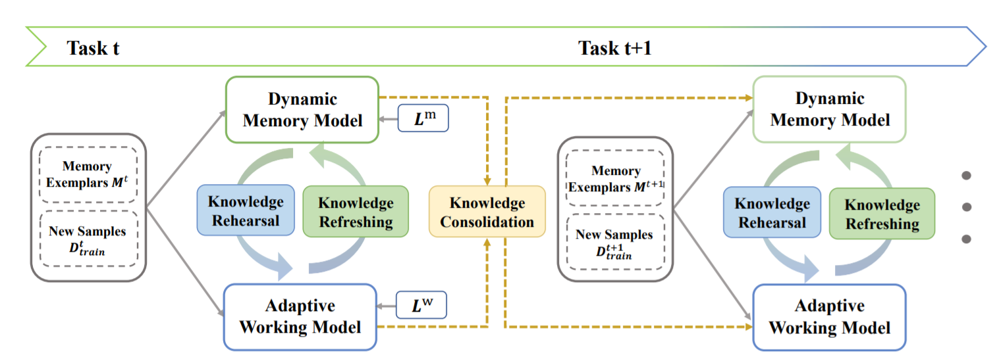

# [AAAI2023] Lifelong Person Re-Identification via Knowledge Refreshing and Consolidation
The official implementation of AAAI 2023 paper "Lifelong Person Re-Identification via Knowledge Refreshing and Consolidation" by Chunlin Yu, Ye Shi, Zimo Liu, Shenghua Gao, Jingya Wang*

[\[Paper\]](https://arxiv.org/abs/2211.16201) | [\[Code\]](https://github.com/cly234/LReID-KRKC)
## Introduction

## Getting Started
### Dataset preparation
- Prepare the dataset structure as in [here](https://github.com/cly234/LReID-KRKC/blob/main/docs/dataset_structure.md).
- Move docs/splits.json file into directory /path/to/your/dataset/viper.
- Covert CUHK-SYSU to cuhksysu4reid following instructions in this [repo](https://github.com/TPCD/LifelongReID).
### Training
```
CUDA_VISBILE_DEVICES=0,1,2,3 python continual_train.py --data-dir=/path/to/your/dataset
```

### Evaluation
```
python evaluate.py --data-dir=/path/to/your/dataset --resume-working=/path/to/working/checkpoints --resume-memory=/path/to/memory/checkpoints
```
### Checkpoints
We provide the checkpints of working model and memory model trained after the last step in [Google Drive]().
## Acknowledgement
- The code framework is based on [PTKP](https://github.com/g3956/PTKP) and [AKA](https://github.com/TPCD/LifelongReID).
- The code for efficient evaluation is borrowed from [TransReID](https://github.com/damo-cv/TransReID).

## Cite this work
If you find our work / code implementation useful for your own research, please cite our paper.
